# 📌 Sistema de Gestão de Equipamentos Hospitalares com RFID/NFC

Este projeto tem como objetivo a gestão e rastreabilidade de equipamentos hospitalares utilizando a tecnologia **NFC/RFID**.  
O sistema permite **cadastro, busca, listagem e gerenciamento** de equipamentos, garantindo maior organização, segurança e eficiência na utilização dos recursos.

---

## 🚀 Funcionalidades

- 🔐 **Login seguro** com área administrativa para controle de usuários.  
- 📝 **Cadastro de equipamentos** manualmente ou via NFC.  
- 📋 **Listagem de equipamentos** cadastrados, com informações essenciais.  
- 📊 **Relatórios e gerenciamento** dos equipamentos em uso, emprestados e inativos.  
- 📡 **Busca de equipamentos** por ID, nome, status ou via NFC.  
- 🏥 **Controle de uso** dos equipamentos em tempo real.  
- 📑 **Histórico de utilização** para auditoria e segurança.  
- ⚙️ **Configurações administrativas** e relatórios avançados.  

---

## 🖼️ Telas do Sistema

### 🔑 Figura 1 – Tela de Login
Tela inicial onde o usuário insere login e senha.  
Possui acesso restrito ao administrador, que pode incluir e excluir usuários.  
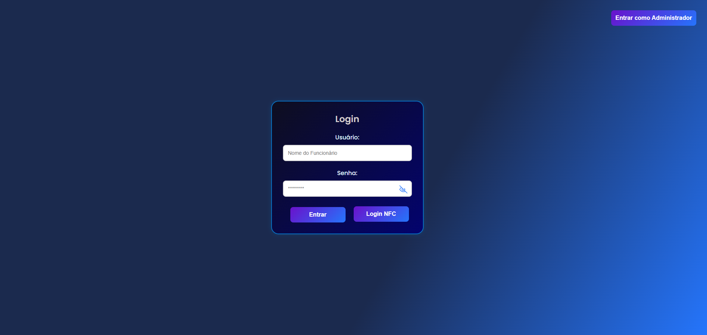

---

### 📝 Figura 2 – Cadastro de Equipamentos
Permite cadastrar equipamentos de duas formas:
- **Manual**: preenchendo ID, nome e status.  
- **Via NFC**: leitura e registro automático.  
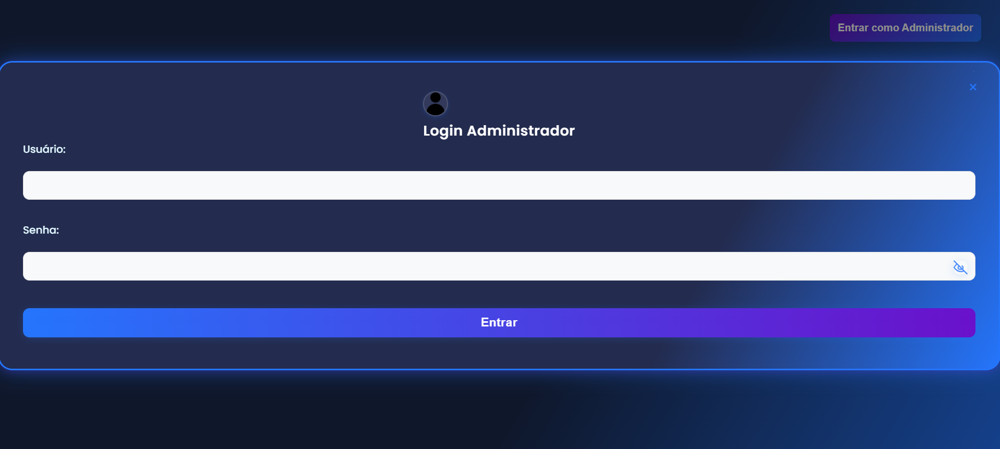

---

### 📋 Figura 3 – Listagem de Equipamentos
Lista todos os equipamentos cadastrados.  
Somente administradores podem excluir registros.  
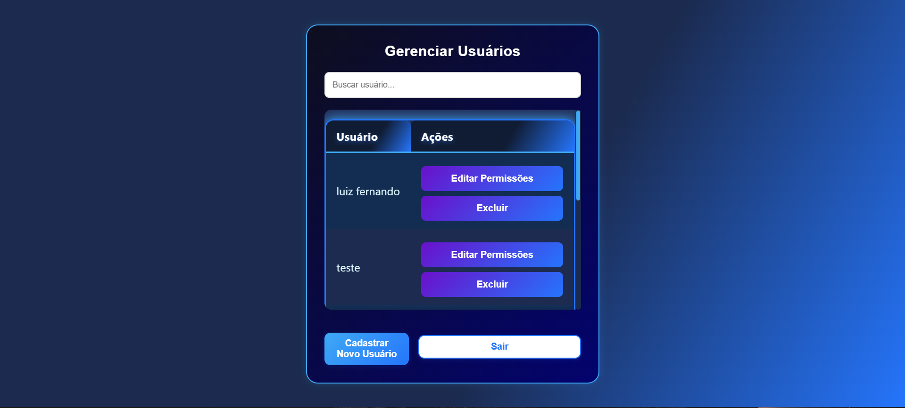

---

### 📊 Figura 4 – Tela de Gerenciamento
Centraliza o acesso às funcionalidades, como cadastro via NFC e busca.  
Exibe relatório com status: **em uso, emprestados e inativos**.  
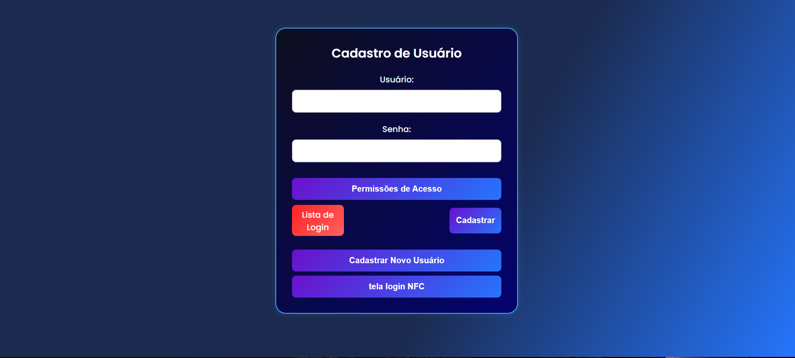

---

### 📡 Figura 5 – Cadastro via NFC
Cadastro automatizado de equipamentos diretamente pela etiqueta NFC.  
Campos obrigatórios: **ID, nome, status**.  
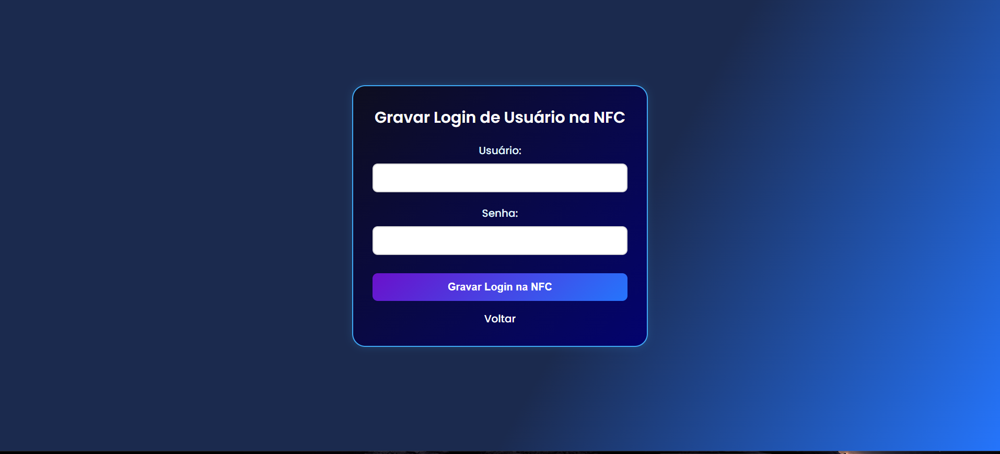

---

### 🔎 Figura 6 – Tela de Busca
Busca de equipamentos por:
- **ID**
- **Nome**
- **Status**
- **NFC** (identificação rápida e atualização automática do status).  
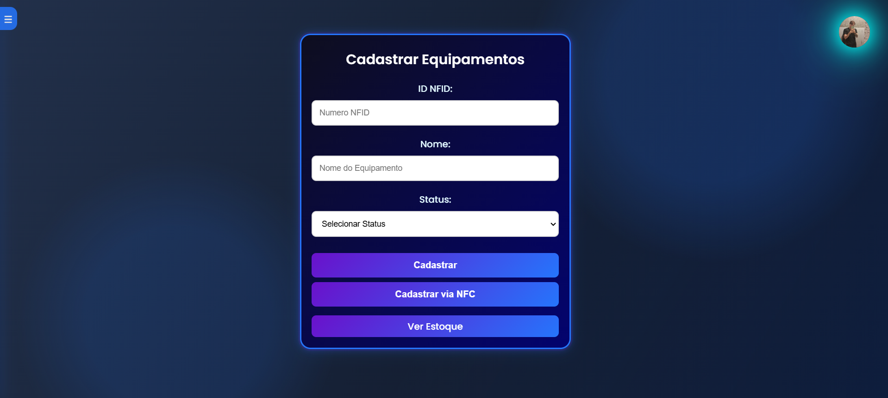

---

### 🏥 Figura 7 – Cadastro de Equipamentos em Uso
Permite registrar quais equipamentos estão em uso, manualmente ou via NFC.  
Informações: **ID** e **local de utilização**.  

---

### 📌 Figura 8 – Listagem de Equipamentos em Uso
Mostra quais equipamentos estão em uso no momento.  
Permite **remoção** após o término da utilização para manter a lista atualizada.  
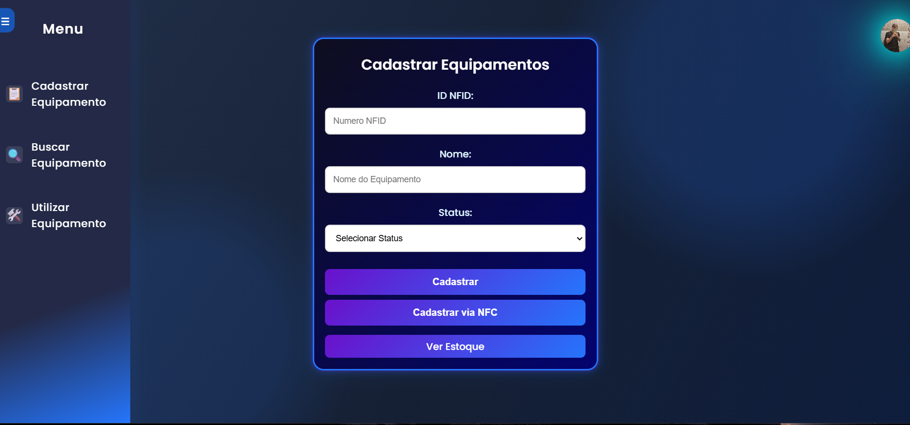

---

### 📑 Figura 9 – Histórico de Utilização
Exibe o histórico de movimentações de cada equipamento, incluindo quem utilizou, quando foi retirado e quando foi devolvido.  
Essa funcionalidade auxilia na **auditoria e segurança**.  
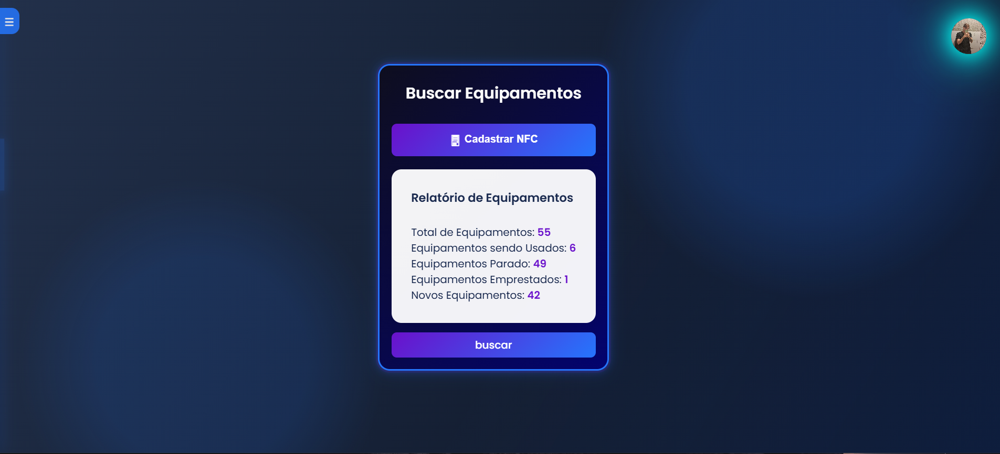

---

### 🗂️ Figura 10 – Detalhes de Equipamento
Mostra informações detalhadas de um equipamento específico, incluindo número de série, status atual, localização e últimas movimentações.  
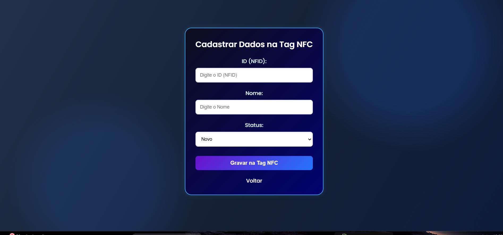

---

### 📊 Figura 11 – Relatórios Avançados
Apresenta relatórios consolidados sobre:
- Equipamentos mais utilizados  
- Tempo médio de uso  
- Ocorrências de falhas ou manutenções  
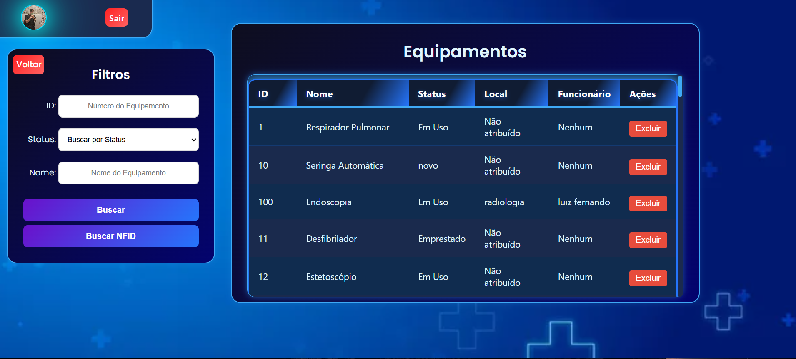

---

### ⚙️ Figura 12 – Configurações Administrativas
Área exclusiva do administrador para ajustar permissões, configurar o sistema e gerenciar cadastros especiais.  

---

### 👤 Figura 13 – Perfil do Usuário
Tela onde cada usuário pode visualizar e editar seus dados de acesso, como senha, e consultar os equipamentos que utilizou recentemente.  
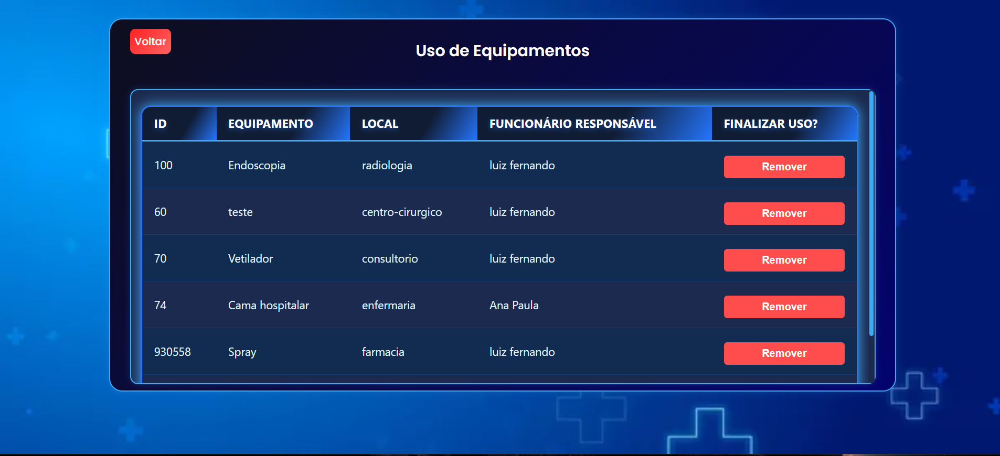

---

### 🛠️ Figura 14 – Tela de Suporte/Manutenção
Funcionalidade para registrar ocorrências relacionadas aos equipamentos, como defeitos, manutenções ou substituições necessárias.  
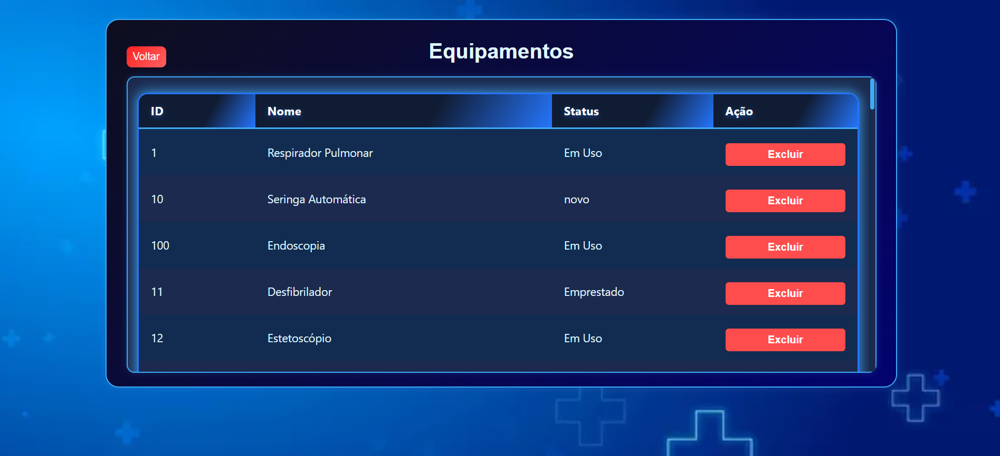

---

## ⚙️ Tecnologias Utilizadas
- **Frontend**: HTML, CSS, JavaScript  
- **Backend**: Node.js com Express  
- **Banco de Dados**: MySQL  
- **Tecnologias Extras**: NFC/RFID para identificação e cadastro  

---

## 📂 Estrutura do Projeto
📦 Projeto
┣ 📂 fotos # Contém prints das telas do sistema
┣ 📂 backend # Código Node.js (API, rotas, banco de dados)
┣ 📂 frontend # Código da interface web
┣ 📜 README.md # Documentação do projeto
┗ 📜 package.json # Dependências do Node.js
## 👨‍💻 Autores
Projeto desenvolvido como protótipo acadêmico pelos acadêmicos de **Sistemas de Informação**.  
